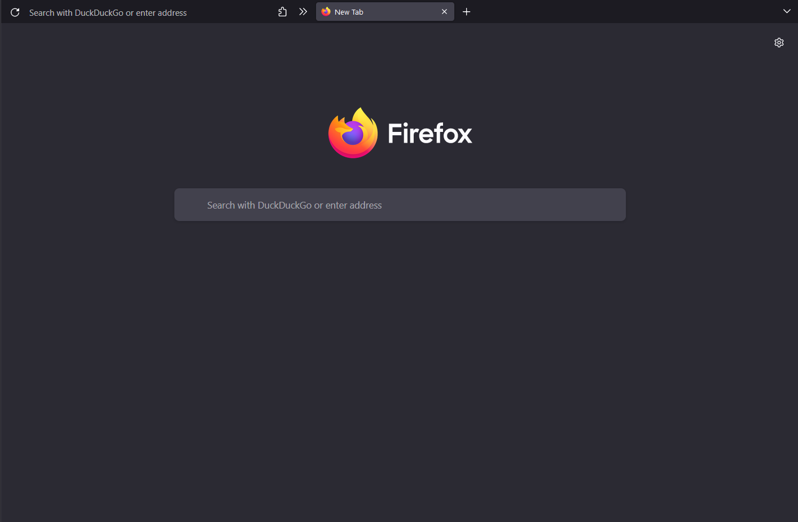

# userChrome.css

A Firefox stylesheet meant to be minimalistic while still being usable with the mouse.

## Installation

Enable the option `toolkit.legacyUserProfileCustomizations.stylesheets` from your `about:config` or `user.js` file. Then open your profile folder (you can find the location in `about:profiles`), create the folder `chrome` inside of it, and place the `userChrome.css` file inside.

Any theme and density should work, but the theme is meant to be used with Firefox's default Dark theme (not the System theme) and Compact density (enabled with the option `browser.compactmode.show` in `about:config`).

If you want to watch a video explaining the installation process, [watch a video here](https://www.youtube.com/watch?v=0QVs1jVuA8c).

## Credits

Based off [ericmurphyxyz/userChrome.css ](https://github.com/ericmurphyxyz/userChrome.css), [FirefoxCSS-Darknight](https://github.com/BriLHR/FirefoxCSS-Darknight) and [keyfox](https://github.com/AlfarexGuy2019/keyfox/), with additional lines from [Cascade](https://github.com/andreasgrafen/cascade).
